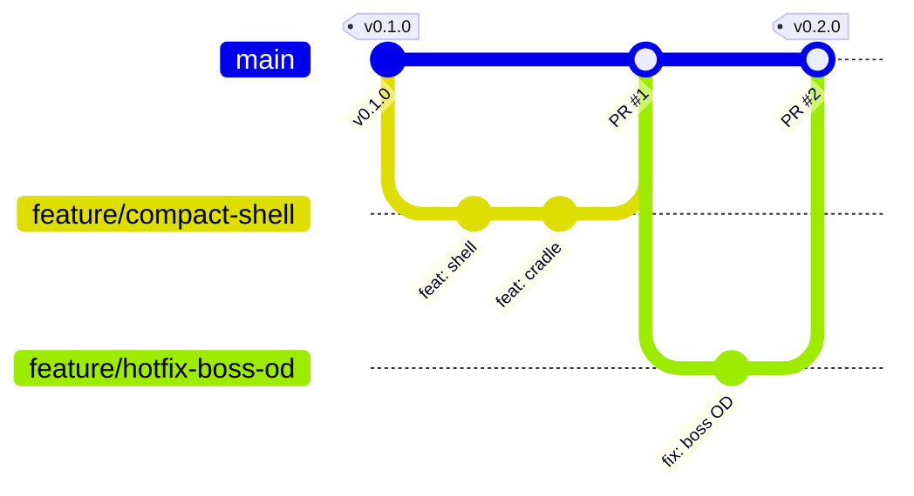

# Contributing

This repo uses a **simplified Git Flow**: `main` is the only long-lived branch — it serves as both
the integration branch and the release branch. All work happens on short-lived `feature/*` branches
merged into `main` via PR; releases are annotated `vX.Y.Z` tags on `main`. There is no `develop`,
`release/*`, `hotfix/*`, or `support/*` branch, and the AVH `git flow` extension is not used — every
recipe below is plain git.

This document is the full recipe book; `.claude/skills/git-flow/SKILL.md` is the condensed version
Claude follows day to day, and `CLAUDE.md`'s "Branching" section has the non-negotiables. Docs, code
comments, and commit messages are English (`CLAUDE.md` "Language rule"); conversation with the user
stays Dutch.

## The model

| Branch | Purpose | Branches from | Merges into | Naming |
|---|---|---|---|---|
| `main` | Integration **and** release branch. Always renders green in CI. Every tagged commit on it is a release `vX.Y.Z` (SemVer). | — | — | `main` |
| `feature/*` | Everything else: a feature, a new case variant, a coupon, a doc change, a routine fix, or an urgent fix on something already released. | `main` | `main` via PR | `feature/<kebab-topic>`, `feature/issue-<n>-<topic>` when a GitHub issue exists, or `feature/hotfix-<topic>` for an urgent fix |

A hotfix is **not** a separate branch type — it's a `feature/*` branch off `main` like any other,
named `feature/hotfix-<topic>` (or `feature/issue-<n>-<topic>` if a GitHub issue tracks it) so it's
recognizable in the branch list. It goes through the same PR → CI-green → merge → tag path as
everything else; there is no separate hotfix workflow to remember.

**Merge policy:** squash-merge or a regular merge commit, maintainer's call — the branch's own
internal history (WIP commits, fixups) doesn't need to survive, only `main`'s. `main` is **never**
force-pushed. A PR only merges once the `render` CI check is green — no exceptions for "small"
changes. Tags are **annotated**: `git tag -a vX.Y.Z -m "..."`, never lightweight.

**Versioning (SemVer):**

| Bump | When |
|---|---|
| MAJOR | A change that makes previously printed parts incompatible — e.g. a panel plate that no longer fits an older shell. |
| MINOR | A new case variant, coupon, or feature that doesn't break existing prints. |
| PATCH | A fix that doesn't change a golden (geometry-affecting) dimension. |

**Commit messages:** [Conventional Commits](https://www.conventionalcommits.org/) — `feat:`, `fix:`,
`docs:`, `chore:`, `ci:`, `test:`, `refactor:`, with an optional scope, e.g. `feat(compact): add
shell`. Every commit made with Claude Code ends with:

```
Co-Authored-By: Claude Fable 5.1 <noreply@anthropic.com>
```

PR bodies written by Claude Code end with `🤖 Generated with [Claude Code](https://claude.com/claude-code)`.

## Diagram



Or, ASCII, if the renderer for this file doesn't support mermaid:

```
main     ----v0.1.0------------------------v0.2.0----
                  \                        /
feature/compact-shell  \--(shell)--(cradle)/
                                            \
                              feature/hotfix-boss-od--(fix: boss OD)
```

## Recipes

Every recipe assumes `origin` is up to date (`git fetch origin` first if unsure).

### Start a feature

```
git switch -c feature/<kebab-topic> main
```

Naming: `feature/<kebab-topic>`, `feature/issue-<n>-<topic>` when a GitHub issue exists (see
`.claude/knowledge/ticket-source.md`) — e.g. `feature/issue-12-vents` — or `feature/hotfix-<topic>`
for an urgent fix on something already released.

### Keep it current

If `main` moves while a feature branch is in flight:

```
git fetch origin
git merge main
```

**Never rebase a branch that's already been pushed** — once it's public (pushed, or a PR is open),
merge `main` into it instead of rewriting its history. Rebase is fine only for a purely local branch
nothing else depends on yet.

### Open the PR

```
git push -u origin feature/<kebab-topic>
gh pr create --base main --title "..." --body "..."
```

Wait for the `render` check to go green before merging. Never merge while it's pending or failing.

### Merge

Squash-merge or a regular merge commit — maintainer's call, based on whether the branch's own commit
history is worth keeping. Either way:

- `main` is never force-pushed.
- The `render` CI check must be green on the PR first.
- Delete the feature branch after merging (locally and on `origin`).

### Release (tag on `main`)

A version bump is a normal change and goes through a normal `feature/*` branch and PR — `main` is
never committed to directly, not even for a release.

1. On `feature/release-vX.Y.Z` (branched from `main`): move `CHANGELOG.md`'s `[Unreleased]` entries
   into a new `## [X.Y.Z] - YYYY-MM-DD` section, and bump the version wherever else it's recorded.
2. `python scripts/build.py all --release` must be green locally — this also enforces the release
   gate (fails on any `WARNING: unmeasured port`).
3. PR into `main` like any other change; merge only once `render` is green.
4. `git checkout main && git pull`
5. `git tag -a vX.Y.Z -m "vX.Y.Z"`
6. `git push origin vX.Y.Z`
7. Pushing the tag triggers `render.yml`'s release job (`on: tags: v*`) — verify the GitHub Release
   was created with the expected `*.stl` / `*.3mf` / `*.manifest.json` assets attached before
   announcing the release; don't assume the job succeeded just because it started.

## Definition of done (PR into `main`)

- [ ] `python scripts/build.py all` passes locally.
- [ ] The `render` CI check is green on the PR.
- [ ] Any golden change (`tests/golden/*.json` diff) is called out explicitly in the PR description
      and justified — a silent golden diff is treated as a regression, not approved by omission.
- [ ] `BOM.md` is updated when parts, connectors, inserts, or fasteners change (see the `bom-update`
      skill).
- [ ] Any deviation from `.claude/knowledge/architecture.md` is recorded in that file's §13
      Deviations log (date, rule, `file:line`, why, resolution) — not silently absorbed.
- [ ] Every Neutrik panel connector is the black `-B` variant, no exceptions.
- [ ] Docs and code comments are English.

## Release checklist

- [ ] `CHANGELOG.md`: `[Unreleased]` entries moved into a new `## [X.Y.Z] - YYYY-MM-DD` section.
- [ ] Goldens frozen/reviewed — no unexplained diffs.
- [ ] `python scripts/build.py all --release` green (this also fails on any `WARNING: unmeasured
      port`, per `render.yml`'s release gate).
- [ ] Version bumped everywhere it's recorded.
- [ ] Tag `vX.Y.Z` (annotated) pushed to `main`.
- [ ] CI release job ran on the tag; GitHub Release exists with `exports/**/*.stl`, `*.3mf`, and
      `*.manifest.json` attached — spot-check the asset list, don't assume the job succeeded just
      because it started.

## Branch protection (GitHub recommendation)

For `main`:

- Require a pull request before merging (no direct pushes).
- Require the `render` status check to pass before merging.
- Do not allow force-pushes.
- Do not allow branch deletion.
- Allow squash merging and merge commits (maintainer picks per PR); rebase merging is not required.

## The one rule that matters most

**Never commit directly on `main`.** Every change reaches it through a PR from a `feature/*` branch
— including urgent fixes, which are just a `feature/hotfix-<topic>` branch like any other. If you
catch yourself with uncommitted work on `main`, see the troubleshooting table in
`.claude/skills/git-flow/SKILL.md` before doing anything destructive.
