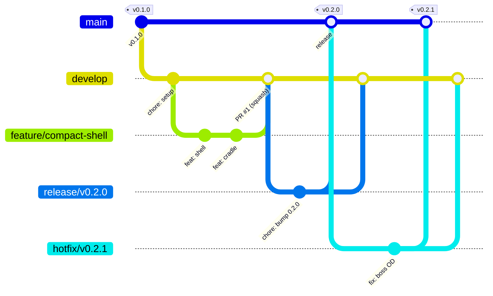

# Contributing

This repo uses **Git Flow** (classic nvie / AVH semantics, adapted for a single-maintainer hardware
repo). This document is the full recipe book; `.claude/skills/git-flow/SKILL.md` is the condensed
version Claude follows day to day, and `CLAUDE.md` has a short pointer + the non-negotiables.

The AVH `git flow` extension is **not required**. Every recipe below is written with **plain git as
the primary path**; the `git flow` equivalent is given alongside for anyone who installs the
extension. Docs, code comments, and commit messages are English (`CLAUDE.md` "Language rule");
conversation with the user stays Dutch.

## The model

| Branch | Purpose | Branches from | Merges into | Naming |
|---|---|---|---|---|
| `main` | Release history only. Every commit on it is a tagged release `vX.Y.Z` (SemVer). | — | — | `main` |
| `develop` | Integration branch. Always renders green in CI. | `main` | — | `develop` |
| `feature/*` | One feature / model / coupon / doc change. | `develop` | `develop` via PR | `feature/<kebab-topic>`, e.g. `feature/compact-shell`, `feature/issue-12-vents` |
| `release/*` | Stabilise a release: goldens frozen, BOM/CHANGELOG updated, version bumped. | `develop` | `main` (tag `vX.Y.Z`) **and** back into `develop` | `release/vX.Y.Z` |
| `hotfix/*` | Urgent fix on a released version. | `main` | `main` (tag `vX.Y.Z+1`) **and** `develop` | `hotfix/vX.Y.Z` |
| `support/*` | Optional, long-lived maintenance of an old major. | `main` tag | — | `support/vX.x` |

**Merge policy:** `--no-ff` merges into `main` and `develop` (keeps the branch topology visible in
`git log --graph`). Feature PRs into `develop` may be **squash-merged** if the branch's own history
is noisy (WIP commits, fixups) — the topology that matters is `develop`/`main`, not every feature
branch's internals. Tags are **annotated**: `git tag -a vX.Y.Z -m "..."`, never lightweight.

**Versioning (SemVer):**

| Bump | When |
|---|---|
| MAJOR | A change that makes previously printed parts incompatible — e.g. a panel plate that no longer fits an older shell. |
| MINOR | A new case variant, coupon, or feature that doesn't break existing prints. |
| PATCH | A fix that doesn't change a golden (geometry-affecting) dimension. |

**Commit messages:** [Conventional Commits](https://www.conventionalcommits.org/) — `feat:`, `fix:`,
`docs:`, `chore:`, `ci:`, `test:`, `refactor:`, with an optional scope, e.g. `feat(compact): add
shell`. Every commit made with Claude Code ends with:

```
Co-Authored-By: Claude Fable 5.1 <noreply@anthropic.com>
```

PR bodies written by Claude Code end with `🤖 Generated with [Claude Code](https://claude.com/claude-code)`.

## Diagram



Or, ASCII, if the renderer for this file doesn't support mermaid:

```
main     ----v0.1.0------------------------v0.2.0----v0.2.1----
                  \                        /    \    /
develop            \--(setup)---(PR#1)----/      \  /
                          \      /                \/
feature/compact-shell      \----/                 /\
                                          hotfix/v0.2.1
```

## Recipes

Every recipe assumes `origin` is up to date (`git fetch origin` first if unsure). The `git flow`
column assumes `git flow init` has been run with `gitflow.branch.master=main`,
`gitflow.branch.develop=develop`, `gitflow.prefix.feature=feature/`,
`gitflow.prefix.release=release/`, `gitflow.prefix.hotfix=hotfix/`,
`gitflow.prefix.support=support/`, `gitflow.prefix.versiontag=v` pre-set, so `git flow init` itself
is a no-op (accepts the existing config instead of prompting).

### Start a feature

| Plain git | `git flow` |
|---|---|
| `git checkout develop && git pull` | `git checkout develop && git pull` |
| `git checkout -b feature/<kebab-topic>` | `git flow feature start <kebab-topic>` |

Naming: `feature/<kebab-topic>`, and `feature/issue-<n>-<topic>` when a GitHub issue exists (see
`.claude/knowledge/ticket-source.md`) — e.g. `feature/issue-12-vents`.

### Finish a feature (PR)

| Plain git | `git flow` |
|---|---|
| `git push -u origin feature/<topic>` | `git flow feature publish <topic>` |
| Open a PR **`feature/<topic>` → `develop`** (`gh pr create --base develop`) | same — `git flow` doesn't open the PR for you either |
| Wait for the `render` check to go green | — |
| Merge (squash or `--no-ff`, maintainer's call) via the GitHub UI/`gh pr merge` | `git flow feature finish <topic>` merges locally with `--no-ff` — prefer the PR route so CI gates the merge |
| Delete the feature branch | `git flow feature finish` deletes it locally by default |

Never merge a feature branch straight to `main`. Never merge while the `render` check is pending or
failing.

### Start a release

| Plain git | `git flow` |
|---|---|
| `git checkout develop && git pull` | `git checkout develop && git pull` |
| `git checkout -b release/vX.Y.Z` | `git flow release start vX.Y.Z` |
| Bump the version wherever it's recorded (export manifests, `CHANGELOG.md` header), move `[Unreleased]` entries into a new `## [X.Y.Z] - YYYY-MM-DD` section | same manual steps — `git flow` doesn't know about `CHANGELOG.md` |
| Freeze goldens: `python scripts/build.py golden --update` only if the diffs are reviewed and intentional | same |
| Commit as `chore(release): vX.Y.Z` | same |

### Finish a release

| Plain git | `git flow` |
|---|---|
| `git push -u origin release/vX.Y.Z`, open PR **`release/vX.Y.Z` → `main`** | `git flow release publish vX.Y.Z` |
| `python scripts/build.py all --release` green (locally and in CI on the PR) | same gate |
| Merge the PR into `main` with `--no-ff` | `git flow release finish vX.Y.Z` does this locally, plus tags and back-merges |
| `git checkout main && git pull && git tag -a vX.Y.Z -m "vX.Y.Z"` (unless GitHub's merge UI already tagged it) | done by `release finish` |
| `git push origin vX.Y.Z` | done by `release finish` |
| Open a second PR **`release/vX.Y.Z` → `develop`** (or merge directly with `--no-ff` if no PR gate is desired for the back-merge) so `develop` gets the version bump and CHANGELOG move too | done by `release finish` |
| Delete `release/vX.Y.Z` | done by `release finish` |

Pushing the tag is what triggers `render.yml`'s release job (`on: tags: v*`) — verify the GitHub
Release was created with the expected STL/3MF/manifest assets attached before announcing the release.

### Start a hotfix

| Plain git | `git flow` |
|---|---|
| `git checkout main && git pull` | `git checkout main && git pull` |
| `git checkout -b hotfix/vX.Y.Z` (the version being fixed *into*, i.e. the new patch version) | `git flow hotfix start vX.Y.Z` |

### Finish a hotfix

| Plain git | `git flow` |
|---|---|
| `git push -u origin hotfix/vX.Y.Z`, open PR **`hotfix/vX.Y.Z` → `main`** | `git flow hotfix publish vX.Y.Z` |
| `python scripts/build.py all --release` green | same gate |
| Merge into `main` with `--no-ff`, tag `vX.Y.Z` | `git flow hotfix finish vX.Y.Z` does merge + tag |
| Also merge/PR into `develop` (`--no-ff`) so the fix isn't lost on the next release | done by `hotfix finish` |
| Delete `hotfix/vX.Y.Z` | done by `hotfix finish` |

## Definition of done (PR into `develop`)

- [ ] `python scripts/build.py all` passes locally.
- [ ] The `render` CI check is green on the PR.
- [ ] Any golden change (`tests/golden/*.json` diff) is called out explicitly in the PR description
      and justified — a silent golden diff is treated as a regression, not approved by omission.
- [ ] `BOM.md` is updated when parts, connectors, inserts, or fasteners change (see the `bom-update`
      skill).
- [ ] Any deviation from `.claude/knowledge/architecture.md` is recorded in that file's §13
      Deviations log (date, rule, `file:line`, why, resolution) — not silently absorbed.
- [ ] Every Neutrik panel connector is the black `-B` variant, no exceptions.
- [ ] Docs and code comments are English.

## Release checklist

- [ ] `CHANGELOG.md`: `[Unreleased]` entries moved into a new `## [X.Y.Z] - YYYY-MM-DD` section.
- [ ] Goldens frozen/reviewed — no unexplained diffs.
- [ ] `python scripts/build.py all --release` green (this also fails on any `WARNING: unmeasured
      port`, per `render.yml`'s release gate).
- [ ] Version bumped everywhere it's recorded.
- [ ] Tag `vX.Y.Z` (annotated) pushed to `main`.
- [ ] CI release job ran on the tag; GitHub Release exists with `exports/**/*.stl`, `*.3mf`, and
      `*.manifest.json` attached — spot-check the asset list, don't assume the job succeeded just
      because it started.
- [ ] `release/vX.Y.Z` back-merged into `develop`.

## Branch protection (GitHub recommendations)

For both `main` and `develop`:

- Require a pull request before merging (no direct pushes).
- Require the `render` status check to pass before merging.
- Do not allow force-pushes.
- Do not allow branch deletion (for `main`/`develop` themselves).

For `main` specifically:

- **Leave "require linear history" OFF** — release/hotfix merges into `main` use `--no-ff` on
  purpose, to keep the merge topology visible; "linear history" would reject exactly the merge
  commits this workflow relies on.

## The one rule that matters most

**Never commit directly on `main` or `develop`.** Every change reaches them through a PR from a
`feature/*`, `release/*`, or `hotfix/*` branch. If you catch yourself with uncommitted work on
`develop` or `main`, see the troubleshooting table in `.claude/skills/git-flow/SKILL.md` before doing
anything destructive.
