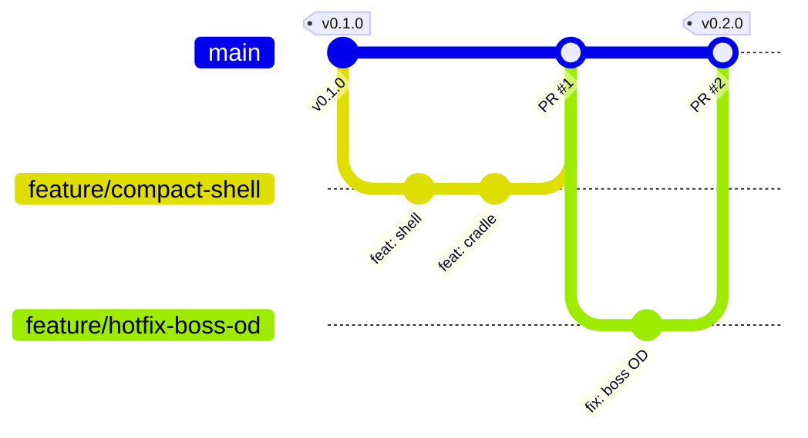

# Contributing

This repo uses a **simplified Git Flow**: `main` is the only long-lived branch — it serves as both
the integration branch and the release branch. All work happens on short-lived `feature/*` branches
merged into `main` via PR; releases are annotated `vX.Y.Z` tags on `main`. There is no `develop`,
`release/*`, `hotfix/*`, or `support/*` branch, and the AVH `git flow` extension is not used — every
recipe below is plain git.

This document is the full recipe book; `.claude/skills/git-flow/SKILL.md` is the condensed version
Claude follows day to day, and `CLAUDE.md`'s "Branching" section has the non-negotiables. Docs, code
comments, and commit messages are English (`CLAUDE.md` "Language rule"); conversation with the user
stays Dutch.

## The model

| Branch | Purpose | Branches from | Merges into | Naming |
|---|---|---|---|---|
| `main` | Integration **and** release branch. Always renders green in CI. Every tagged commit on it is a release `vX.Y.Z` (SemVer). | — | — | `main` |
| `feature/*` | Everything else: a feature, a new case variant, a coupon, a doc change, a routine fix, or an urgent fix on something already released. | `main` | `main` via PR | `feature/<kebab-topic>`, `feature/issue-<n>-<topic>` when a GitHub issue exists, or `feature/hotfix-<topic>` for an urgent fix |

A hotfix is **not** a separate branch type — it's a `feature/*` branch off `main` like any other,
named `feature/hotfix-<topic>` (or `feature/issue-<n>-<topic>` if a GitHub issue tracks it) so it's
recognizable in the branch list. It goes through the same PR → CI-green → merge → tag path as
everything else; there is no separate hotfix workflow to remember.

**Merge policy:** squash-merge or a regular merge commit, maintainer's call — the branch's own
internal history (WIP commits, fixups) doesn't need to survive, only `main`'s. `main` is **never**
force-pushed. A PR only merges once the `render` CI check is green — no exceptions for "small"
changes. Tags are **annotated**: `git tag -a vX.Y.Z -m "..."`, never lightweight.

**Versioning (SemVer):**

| Bump | When |
|---|---|
| MAJOR | A change that makes previously printed parts incompatible — e.g. a panel plate that no longer fits an older shell. |
| MINOR | A new case variant, coupon, or feature that doesn't break existing prints. |
| PATCH | A fix that doesn't change a golden (geometry-affecting) dimension. |

**Commit messages:** [Conventional Commits](https://www.conventionalcommits.org/) — `feat:`, `fix:`,
`docs:`, `chore:`, `ci:`, `test:`, `refactor:`, with an optional scope, e.g. `feat(compact): add
shell`. Every commit made with Claude Code ends with:

```
Co-Authored-By: Claude Fable 5.1 <noreply@anthropic.com>
```

PR bodies written by Claude Code end with `🤖 Generated with [Claude Code](https://claude.com/claude-code)`.

## Diagram



Or, ASCII, if the renderer for this file doesn't support mermaid:

```
main     ----v0.1.0------------------------v0.2.0----
                  \                        /
feature/compact-shell  \--(shell)--(cradle)/
                                            \
                              feature/hotfix-boss-od--(fix: boss OD)
```

## Recipes

Every recipe assumes `origin` is up to date (`git fetch origin` first if unsure).

### Start a feature

```
git switch -c feature/<kebab-topic> main
```

Naming: `feature/<kebab-topic>`, `feature/issue-<n>-<topic>` when a GitHub issue exists (see
`.claude/knowledge/ticket-source.md`) — e.g. `feature/issue-12-vents` — or `feature/hotfix-<topic>`
for an urgent fix on something already released.

### Keep it current

If `main` moves while a feature branch is in flight:

```
git fetch origin
git merge main
```

**Never rebase a branch that's already been pushed** — once it's public (pushed, or a PR is open),
merge `main` into it instead of rewriting its history. Rebase is fine only for a purely local branch
nothing else depends on yet.

### Open the PR

```
git push -u origin feature/<kebab-topic>
gh pr create --base main --title "..." --body "..."
```

Wait for the `render` check to go green before merging. Never merge while it's pending or failing.

### Merge

Squash-merge or a regular merge commit — maintainer's call, based on whether the branch's own commit
history is worth keeping. Either way:

- `main` is never force-pushed.
- The `render` CI check must be green on the PR first.
- Delete the feature branch after merging (locally and on `origin`).

### Release (automatic, on merge to `main`)

**There is no manual tagging step any more.** `.github/workflows/release.yml` runs on every push to
`main` (i.e. every merged PR) and does the whole thing:

1. `scripts/release_version.py` computes the next `vX.Y.Z` from
   [Conventional Commits](https://www.conventionalcommits.org/) since the last `v*` tag reachable
   from `HEAD` — a `BREAKING CHANGE:` footer or a `!` before the `:` (`feat!:`, `fix(scope)!:`)
   bumps MAJOR, a `feat` commit bumps MINOR, anything else bumps PATCH.
2. `python scripts/build.py all --with-step` builds and tests everything, including STEP export
   (`scripts/mesh_to_step.py`, `build.py step`).
3. `python scripts/build.py confidence --json` reports every port below `measured` confidence
   across all device data files. Unlike the old `--release` gate (which used to **fail** the build
   on any `WARNING: unmeasured`), this only sets the GitHub Release's **pre-release** flag —
   see "Pre-release" below.
4. `scripts/package_release.py vX.Y.Z` builds one zip per device case (STL + 3MF + STEP + manifest
   + a `README.txt`) plus a `coupons-vX.Y.Z.zip`, copies every rendered STEP file loose into
   `dist/step/<slug>-<part>.step` (e.g. `pro-convert-for-ndi-to-hdmi-base.step`,
   `coupons-neutrik-tile.step` — unique, self-describing names; the old bare `<part>.step` names
   collided once there were eight-plus device cases, see issue #10), and writes
   `dist/SHA256SUMS.txt` over every file in `dist/`.
5. An **annotated** tag `vX.Y.Z` is created and pushed (never lightweight — see "Versioning" above).
6. `softprops/action-gh-release` publishes the GitHub Release with the zips, the loose
   `dist/step/*.step` files, and `dist/SHA256SUMS.txt` attached.

**Nothing to do locally to cut a release** beyond merging a PR into `main` with commit messages
that follow Conventional Commits — the bump type is read from them. If you want a specific bump
that doesn't match your commits' actual types, that's a signal to reconsider the commit messages,
not to hand-edit a version number somewhere.

**Pre-release.** A release is marked **pre-release** on GitHub whenever any port in any device data
file (`lib/mcc/devices/*.scad`) is below `measured` confidence — which, per
`.claude/knowledge/architecture.md` §7, is every port on every device today (nobody has measured
one yet). This is expected during early development; it stops once a device's ports are physically
measured and its record's `confidence` fields are upgraded to `"measured"`.

**Verifying a release actually happened:** after a PR merges to `main`, check the `release` workflow
run — don't assume it succeeded just because it started. Confirm the GitHub Release exists with the
expected `dist/*.zip`, loose `dist/step/*.step`, and `dist/SHA256SUMS.txt` assets attached, and that
its `vX.Y.Z` matches what you expected from the merged commits.

**Hotfix note:** there is no separate hotfix release path either — a `feature/hotfix-<topic>` branch
merges to `main` like any other PR and the next push-to-`main` release picks it up automatically
(a `fix:` commit bumps PATCH).

## Definition of done (PR into `main`)

- [ ] `python scripts/build.py all` passes locally.
- [ ] `python scripts/build.py step --all` succeeds locally, or the STEP backend genuinely isn't
      available on your machine (`build.py doctor` reports which) — CI always has one and will
      catch a broken conversion either way (`render.yml` runs `step --all` on every PR).
- [ ] The `render` CI check is green on the PR.
- [ ] Any golden change (`tests/golden/*.json` diff) is called out explicitly in the PR description
      and justified, and is scoped to the device(s) the PR actually touches — a silent golden diff,
      or one outside the intended device, is treated as a regression, not approved by omission.
- [ ] `BOM.md` is updated when parts, connectors, inserts, or fasteners change (see the `bom-update`
      skill).
- [ ] Any deviation from `.claude/knowledge/architecture.md` is recorded in that file's §13
      Deviations log (date, rule, `file:line`, why, resolution) — not silently absorbed.
- [ ] Every Neutrik panel connector is the black `-B` variant, no exceptions.
- [ ] Docs and code comments are English.
- [ ] `CHANGELOG.md`'s `[Unreleased]` section has an entry for this change — releasing is now
      automatic (see "Release" above), so this is the only changelog step a PR author does; a
      maintainer periodically retitles `[Unreleased]` into a dated `## [X.Y.Z] - YYYY-MM-DD` section
      matching whatever `release.yml` actually tagged, as separate housekeeping.

## Release checklist (verifying an automatic release, after merge)

There is no pre-release checklist to run before merging any more — merging the PR *is* what starts
a release (see "Release" above). After merge:

- [ ] The `release` GitHub Actions run for the merge commit succeeded — don't assume it did just
      because it started.
- [ ] The computed `vX.Y.Z` (workflow run's "Compute next version" step output) matches what you
      expected from the merged commits' Conventional Commits types.
- [ ] The GitHub Release exists with `dist/*.zip` (one per device + `coupons-vX.Y.Z.zip`), the
      loose `dist/step/<slug>-<part>.step` files, and `dist/SHA256SUMS.txt` attached — spot-check
      the asset list for uniqueness (no two assets share a name).
- [ ] The release's pre-release flag matches expectations: pre-release if any device still has a
      port below `measured` confidence (true for every device today), not pre-release once a
      device's ports are fully measured.

## Branch protection (GitHub recommendation)

For `main`:

- Require a pull request before merging (no direct pushes).
- Require the `render` status check to pass before merging.
- Do not allow force-pushes.
- Do not allow branch deletion.
- Allow squash merging and merge commits (maintainer picks per PR); rebase merging is not required.

## The one rule that matters most

**Never commit directly on `main`.** Every change reaches it through a PR from a `feature/*` branch
— including urgent fixes, which are just a `feature/hotfix-<topic>` branch like any other. If you
catch yourself with uncommitted work on `main`, see the troubleshooting table in
`.claude/skills/git-flow/SKILL.md` before doing anything destructive.
